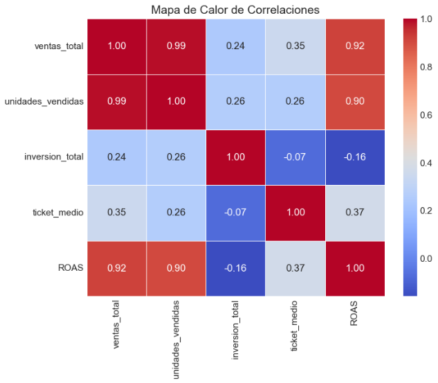

# 🇬🇧 Sales Data Processing Pipeline & ROI Analytics

This project features an End-to-End **Python Data Pipeline (ETL)** designed to ingest, clean, transform, and model data from heterogeneous sources (Sales, Customers, and Marketing Campaigns). 

The pipeline automates data quality cleaning, performs relational joins using Pandas, calculates key commercial metrics (such as ROAS and average ticket), and outputs an interactive analytical dataset for data-driven decision-making.

## — Data Pipeline Architecture (ETL)

1. **Extraction:** Ingestion of raw datasets across multiple business domains (Sales, Marketing, Customers).
2. **Transformation (Pandas):** 
   - Automated data type conversion and currency parsing.
   - Deduplication and missing value resolution strategies.
   - Relational joins (merges) across entities (Customer IDs, Campaign Keys).
   - Dynamic aggregation of monthly revenues and campaign performance (ROAS).
3. **Serving / Analytics:** Production of interactive dashboards (Plotly) and structured analytical tables.

## — Interactive Dashboard

*This project features an interactive key performance indicator (KPI) dashboard developed on top of the processed data:*

## — Technologies and Libraries Used

- **Python 3.12**
- **Pandas** (Data Processing & ETL)
- **Matplotlib & Seaborn**
- **Plotly** (Graph Objects & Subplots)

## — Three Key Findings

### 1. Seasonal Revenue Flows and Monthly Trends
- There is considerable variability in the monthly revenue flow.
- The highest revenue peaked in May 2024, followed by a notable drop in June.
- **Recommendation:** Review the commercial strategy implemented in May to identify the drivers behind this surge in order to replicate it.

### 2. Product Catalog Characterization
- The Desk Lamp (Lámpara de Mesa) ranks as the product with the highest sales volume.
- Technology and Home appliance items (e.g., Headphones and Microwaves) form the revenue foundation of the organization.

### 3. Marketing Investment Effectiveness (ROAS)
- **Low Correlation:** Linear correlation analysis revealed a coefficient of 0.24 between marketing investment and total sales. This indicates there is no clear correlation between ad spend and sales; meaning, a higher advertising budget does not guarantee increased sales.

- **ROAS Distribution:** The Return on Ad Spend distribution is normal, broadly centered between 3,000 and 4,000.
- **Organic Sales:** The scatter plot identified "High-Performance" products that experience high sales with a tight (medium/low) marketing budget. This indicates high organic demand without relying significantly on advertising scale.

## — Strategic Business Recommendations

1. **Audit Ineffective Campaigns:** Reorganize or pause ad campaigns for items with high promotional costs but low sales performance.
2. **Budget Reallocation:** Reallocate freed-up resources to the Decoration and Lighting categories (such as the Desk Lamp), boosting their visibility since they contain the products with the highest organic traction.

---

# 🇪🇸 Pipeline de Procesamiento de Datos de Ventas y Análisis de ROI

Este proyecto presenta un **Pipeline de Datos en Python (ETL)** de extremo a extremo, diseñado para ingerir, limpiar, transformar y modelar datos provenientes de fuentes heterogéneas (Ventas, Clientes y Campañas de Marketing). 

El flujo automatiza la limpieza y calidad de datos, realiza cruces relacionales (joins) utilizando Pandas, calcula métricas comerciales clave (como el ROAS) y genera un modelo de datos analítico para la toma de decisiones.

## — Arquitectura del Pipeline (ETL)

1. **Extracción (Ingesta):** Lectura de conjuntos de datos crudos de múltiples dominios comerciales.
2. **Transformación (Pandas):** 
   - Conversión de tipos de datos y parseo de monedas.
   - Resolución de valores nulos y estrategias de deduplicación.
   - Unificación de tablas (merges) mediante IDs relacionales (Clientes, Campañas).
   - Agregaciones dinámicas de facturación mensual y rendimiento de campañas.
3. **Disponibilidad (Serving):** Creación de un dataset analítico estructurado y dashboards interactivos (Plotly).

## — Dashboard Interactivo

*Este proyecto presenta un dashboard interactivo de control de métricas clave (KPIs) desarrollado a partir de los datos procesados:*

## — Tecnologías y Librerías Utilizadas

- **Python 3.12**
- **Pandas** (Procesamiento de Datos y ETL)
- **Matplotlib & Seaborn**
- **Plotly** (Graph Objects & Subplots)

## — Tres hallazgos clave

### 1. Flujos de Ingreso Estacionales y Menciones Mensuales
- La variabilidad del flujo de ingresos mensual es considerable.
- La mayor facturación alcanzó su punto máximo el mes de Mayo de 2024, con una disminución notable ocurriendo en Junio.
- **Recomendación:** revisar la estrategia comercial implementada en Mayo, buscando las causas que llevaron a tal aumento.

### 2. Caracterización del Catálogo de Producto
- La Lámpara de Mesa se posiciona como el producto con el mayor volumen de ventas.
- Los artículos de las categorías Tecnología y Hogar (por ejemplo: Auriculares y Microondas), forman la base de ingresos de la organización.

### 3. Eficacia de la Inversión en Marketing (ROAS)
- **Baja Correlación:** el análisis de correlación lineal reveló un coeficiente de 0.24 entre la inversión en marketing y las ventas totales. Esto indica que no existe una correlación clara entre la inversión y las ventas; es decir, un incremento presupuestario en publicidad no asegura mayores ventas.

- **Distribución del ROAS:** la distribución del retorno de inversión publicitaria se presenta de manera normal, centrándose en un amplio espectro de ROAS entre 3,000 y 4,000.
- **Ventas Orgánicas:** el gráfico de dispersión mostró productos clasificados como "Alto Rendimiento", que experimentan ventas elevadas con un presupuesto de marketing ajustado (mediano/bajo). Esto indica una alta demanda orgánica sin depender significativamente del aumento o baja de la publicidad.

## — Recomendaciones Estratégicas para el Negocio

1. **Auditoría de Campañas Ineficaces:** reorganizar o suspender la programación publicitaria para aquellos artículos que presentan elevados costos de promoción pero un bajo rendimiento en ventas.
2. **Reubicación del Presupuesto:** reasignar la cantidad de recursos liberados a las secciones de **Decoración e Iluminación** (como la lámpara de mesada), potenciando su visibilidad ya que contienen los productos de mayor tracción orgánica del negocio.
