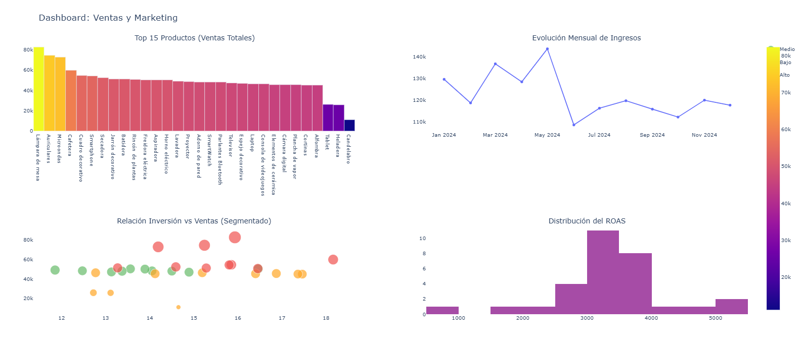

# Análisis de Performance de Ventas y Retorno de Inversión (ROI) de Marketing

Este proyecto presenta un análisis exploratorio de datos (EDA) y la creación de un modelo de visualización interactivo para evaluar el rendimiento comercial y la efectividad de las campañas de marketing de la empresa.

El objetivo principal fue unificar bases de datos de Ventas, Clientes y Campañas de Marketing para identificar estacionalidades, productos estrella y la relación real entre la inversión publicitaria y el retorno financiero (ROAS).

## Dashboard Interactivo

_Este proyecto presenta un dashboard interactivo de control de métricas clave (KPIs) desarrollado para la toma de decisiones:_

## Tecnologías y Librerías Utilizadas

- **Python 3.12**.
- **Pandas**.
- **Matplotlib & Seaborn**.
- **Plotly (Graph Objects & Subplots)**.
